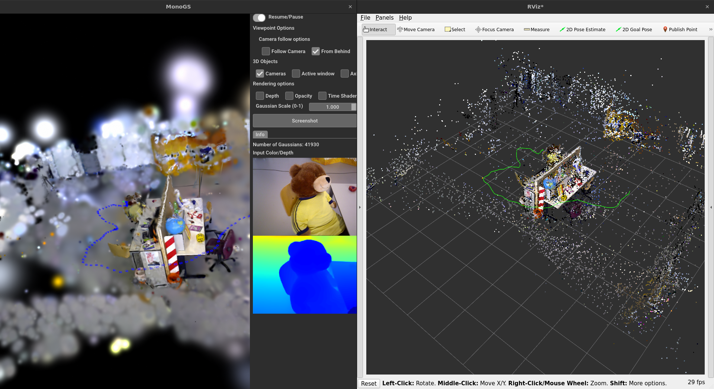
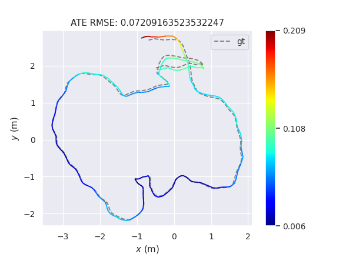
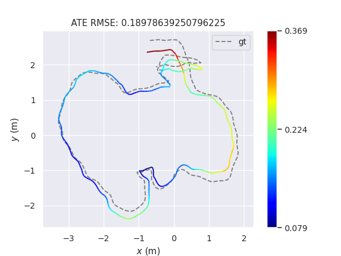
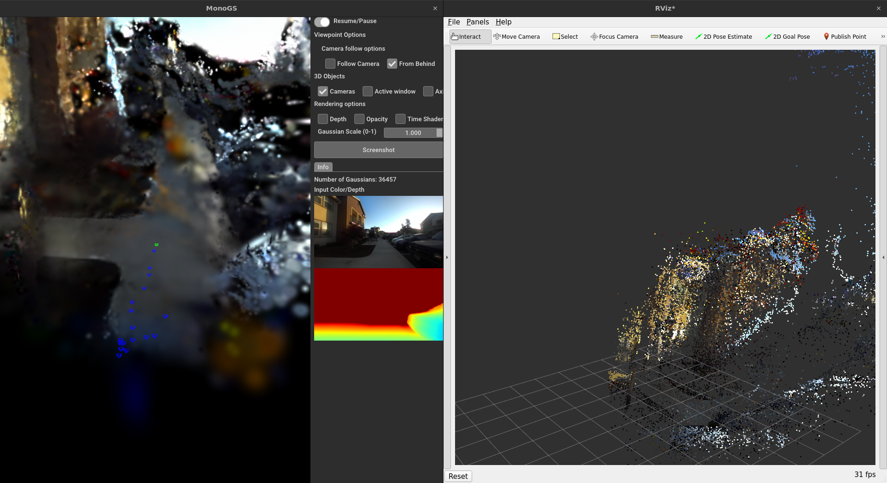

# RGBD-3DGS-SLAM
RGBD-3DGS-SLAM is a monocular SLAM system leveraging 3D Gaussian Splatting (3DGS) for accurate point cloud and visual odometry estimation. By integrating neural networks, it estimates depth and camera intrinsics from RGB images alone, with optional support for additional camera information and depth maps. The system outputs high-quality Point Cloud and Visual Odometry, making it versatile for various robotic and computer vision applications.

<div align="center">
    
    <p>MonoGS with UniDepthV2 and ROS 2</p>
</div>

## 🏁 Dependencies

Clone the repo and the submodules using 
```
https://github.com/jagennath-hari/RGBD-3DGS-SLAM --recursive
```
Or build from source using these libraries.

1) PyTorch ([Official Link](https://pytorch.org/)).
2) MonoGS ([Official Link](https://github.com/muskie82/MonoGS)).
3) UniDepth ([Official Link](https://github.com/lpiccinelli-eth/UniDepth)).
4) RoboStack ROS 2 Humble ([Offical Link](https://robostack.github.io/GettingStarted.html)).

There is also enviroment.yml file, you can install or use as a reference using
```
conda env create -f environment.yml
```

## Downloading TUM dataset
```
cd MonoGS && bash scripts/download_tum.sh
```

## ⌛️ Running SLAM on TUM
```cd MonoGS``` Move to this directory.
### TUM office
You can run the system on the TUM dataset using the same method from the [original repository](https://github.com/muskie82/MonoGS).

#### Monocular mode
```
python slam.py --config configs/mono/tum/fr3_office.yaml
```

#### RGB-D mode without using the ground truth data
The code has been refactored to not use the ground truth depth but the depth from UniDepthV2 instead. It can be run similary provided by [original repository](https://github.com/muskie82/MonoGS). A new directory call `neural_depth` will get created and new depth will be available in it. 

```
python slam.py --config configs/rgbd/tum/fr3_office.yaml
```

##### Comparison

<table>
  <tr>
    <td align="center">
      
      <br>
      <i>Original MonoGS Result</i>
    </td>
    <td align="center">
      
      <br>
      <i>MonoGS with UniDepthV2 Result</i>
    </td>
  </tr>
</table>


## 📈 Running Real-Time using ROS 2
To run using any camera you can leverage ROS 2 publisher-subscriber protocol. A new config file `MonoGS/configs/live/ROS.yaml` will allow you to use ROS 2.

You can change the topic names in file. An example given below.

```
ROS_topics:
  camera_topic: '/zed2i/zed_node/rgb/image_rect_color'
  camera_info_topic: '/zed2i/zed_node/rgb/camera_info'
  depth_topic: '/zed2i/zed_node/depth/depth_registered'
  depth_scale: 1
```

The `camera topic` is mandatory, but `camera_info_topic` and `depth_topic` are optional.

The other combinations are
1) An uncalibrated camera but have depth maps.
```
ROS_topics:
  camera_topic: '/zed2i/zed_node/rgb/image_rect_color'
  camera_info_topic: 'None'
  depth_topic: '/zed2i/zed_node/depth/depth_registered'
  depth_scale: 1
```
2) A Calibrated camera but do not have depth maps.
```
ROS_topics:
  camera_topic: '/zed2i/zed_node/rgb/image_rect_color'
  camera_info_topic: '/zed2i/zed_node/rgb/camera_info'
  depth_topic: 'None'
  depth_scale: 1
```
3) An uncalibrated camera without depth maps.
```
ROS_topics:
  camera_topic: '/zed2i/zed_node/rgb/image_rect_color'
  camera_info_topic: 'None'
  depth_topic: 'None'
  depth_scale: 1
```
[UniDepthV2](https://github.com/lpiccinelli-eth/UniDepth) will can estimate both camera intresnics and metric depth map. So an RGB-D Image will be produced regardless.

To execute the SLAM system
Move to MonoGS directory if not already ```cd MonoGS```.

Use ```python slam.py --config configs/live/ROS.yaml``` to start the system.

### Real-Time ROS 2 output Viewer and in RVIZ 2
<div align="center">
    
    <p>MonoGS with UniDepthV2 and ROS 2</p>
</div>

#### ROS 2 message outputs
During operation the system will output two topics:
1) /monoGS/cloud (sensor_msgs/PointCloud2)
2) /monoGS/trajectory (nav_msgs/Path)

## 📖 Citation
If you found this code/work to be useful in your own research, please considering citing the following:
```bibtex
@inproceedings{Matsuki:Murai:etal:CVPR2024,
  title={{G}aussian {S}platting {SLAM}},
  author={Hidenobu Matsuki and Riku Murai and Paul H. J. Kelly and Andrew J. Davison},
  booktitle={Proceedings of the IEEE/CVF Conference on Computer Vision and Pattern Recognition},
  year={2024}
}
```
```bibtex
@inproceedings{piccinelli2024unidepth,
    title={UniDepth: Universal Monocular Metric Depth Estimation},
    author = {Piccinelli, Luigi and Yang, Yung-Hsu and Sakaridis, Christos and Segu, Mattia and Li, Siyuan and Van Gool, Luc and Yu, Fisher},
    booktitle = {IEEE Conference on Computer Vision and Pattern Recognition (CVPR)},
    year={2024}
}
```

## License
This software is released under BSD-3-Clause license. You can view a license summary [here](LICENSE).